# EventBookingSystem (MERN)

Event booking platform inspired by Eventbrite and Ticketmaster.

## 1) Features
- Browse events with city/category filtering and calendar view
- User/Admin authentication with JWT and role-based access
- Admin event CRUD (create/update/delete, availability and pricing control)
- Booking flow with seat availability checks
- Stripe and PayPal payment integration (with webhook support)
- My Bookings page with pending/paid states and payment retry
- Notifications and reminder job
- Responsive UI with homepage categories, hero section, and footer

## 2) Tech Stack
- MongoDB
- Express.js
- React (Vite)
- Node.js

## 3) Version Details (Local)
- Node.js: `v24.14.1`
- npm: `11.11.0`
- MongoDB: `v8.2.6`

## 4) Project Structure
- `backend/` -> API, DB models, controllers, routes, middleware
- `frontend/` -> React UI, pages, components, styles

## 5) Local Setup

### Prerequisites
- Node.js installed
- MongoDB installed and running

### Backend setup
1. Open terminal:
   - `cd backend`
2. Install dependencies:
   - `npm install`
3. Create env file:
   - Copy `.env.example` -> `.env`
4. Update required env values in `backend/.env`:
   - `PORT`
   - `MONGO_URI`
   - `JWT_SECRET`
   - `CLIENT_URL`
   - `STRIPE_SECRET_KEY`
   - `STRIPE_WEBHOOK_SECRET`
   - `PAYPAL_CLIENT_ID`
   - `PAYPAL_CLIENT_SECRET`
   - `PAYPAL_MODE`
   - `PAYPAL_WEBHOOK_ID`
5. (Optional) Seed data:
   - `npm run seed`
6. Start backend:
   - `npm run dev`

Backend runs on: `http://localhost:5000`

### Frontend setup
1. Open terminal:
   - `cd frontend`
2. Install dependencies:
   - `npm install`
3. Create env file:
   - Copy `.env.example` -> `.env`
4. Update required env values in `frontend/.env`:
   - `VITE_API_URL`
   - `VITE_STRIPE_PUBLISHABLE_KEY`
   - `VITE_PAYPAL_CLIENT_ID`
5. Start frontend:
   - `npm run dev`

Frontend runs on: `http://localhost:5173`

## 6) Payment Setup (Real)

### Stripe
1. Create Stripe account and get API keys.
2. Set `STRIPE_SECRET_KEY` in backend and `VITE_STRIPE_PUBLISHABLE_KEY` in frontend.
3. Add Stripe webhook endpoint:
   - `POST /api/payments/webhooks/stripe`
4. Subscribe to:
   - `payment_intent.succeeded`
5. Set `STRIPE_WEBHOOK_SECRET` from Stripe dashboard.

### PayPal
1. Create PayPal Developer app (Sandbox first).
2. Set `PAYPAL_CLIENT_ID`, `PAYPAL_CLIENT_SECRET`, `PAYPAL_MODE`.
3. Set frontend `VITE_PAYPAL_CLIENT_ID`.
4. Add PayPal webhook endpoint:
   - `POST /api/payments/webhooks/paypal`
5. Set `PAYPAL_WEBHOOK_ID`.

## 7) Default Seed Admin
- Email: `admin@smartwinnr.com`
- Password: `Admin@123`
## 📸 Screenshots

### Home Page
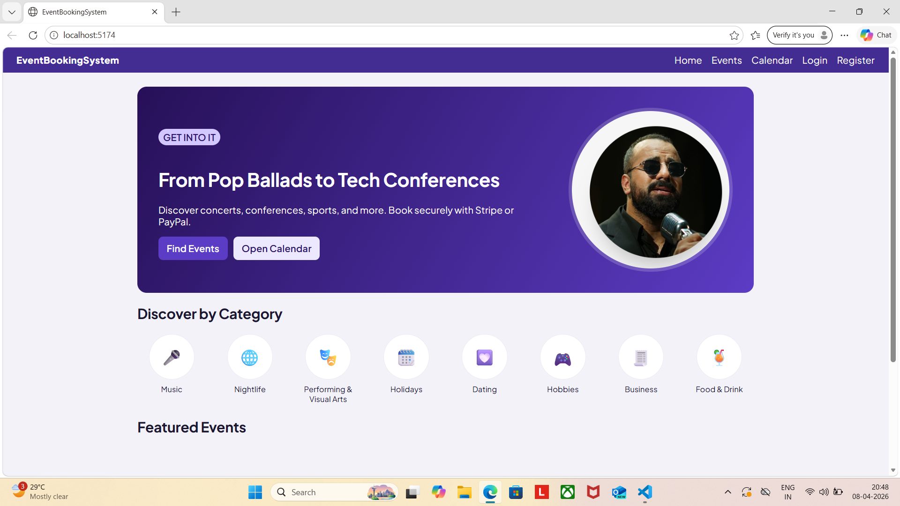

### Login Page
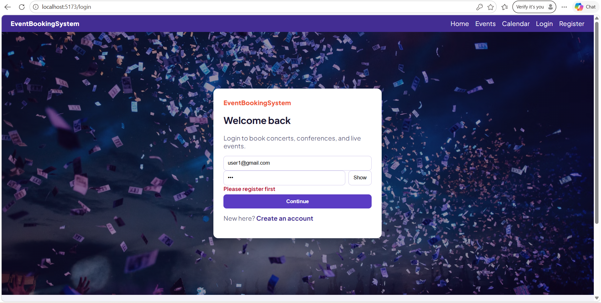

### Register Page
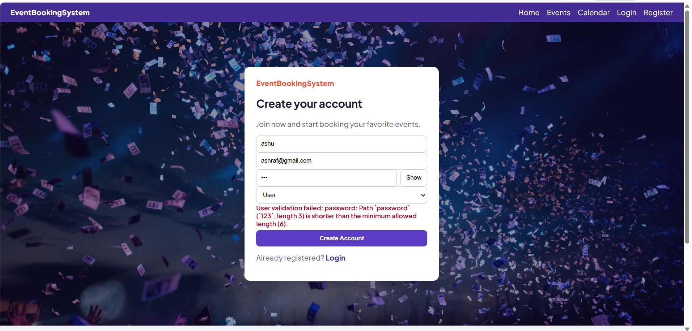

### Registration Success
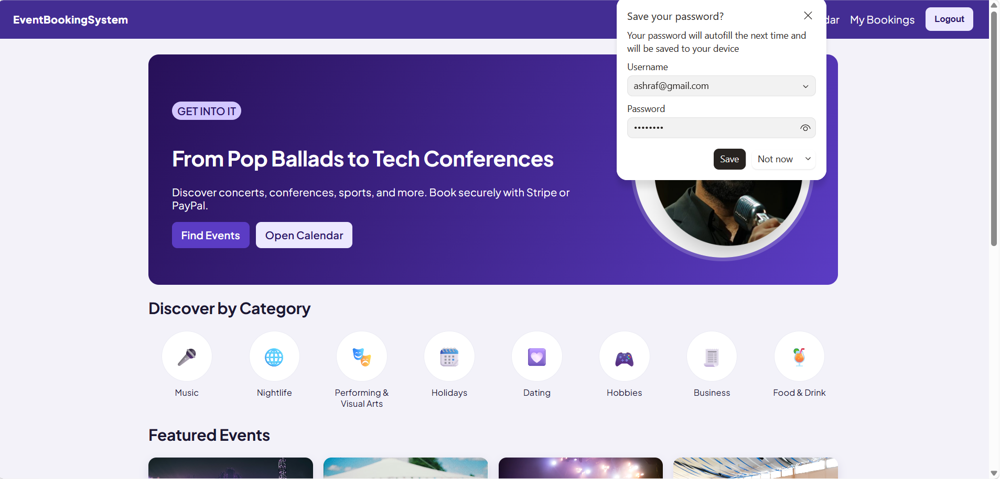

### Entire Homepage
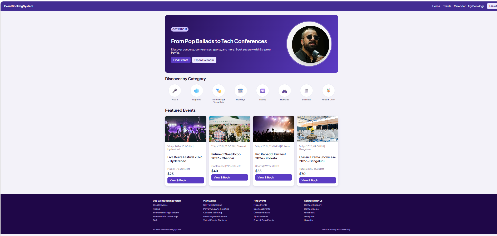

### Events Filtering
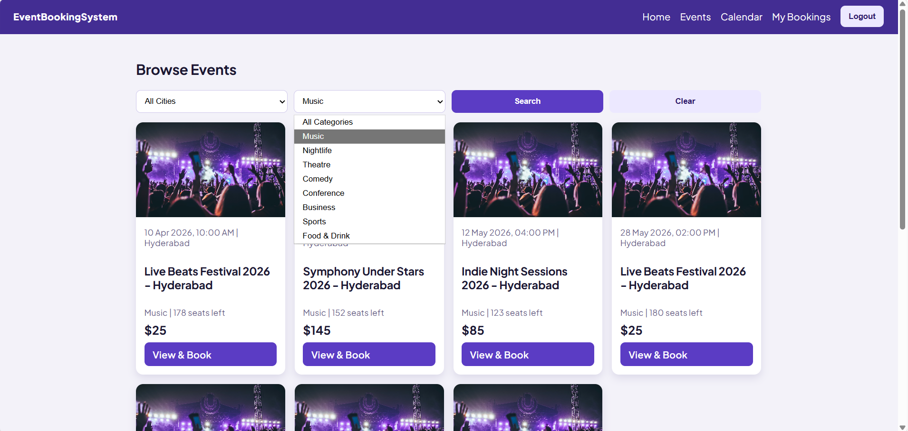

### Search & Filtering
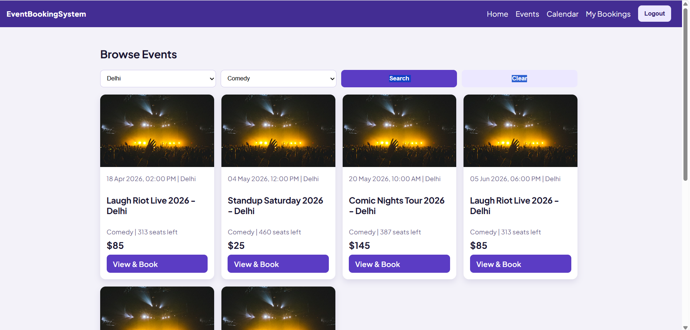

### Event Booking
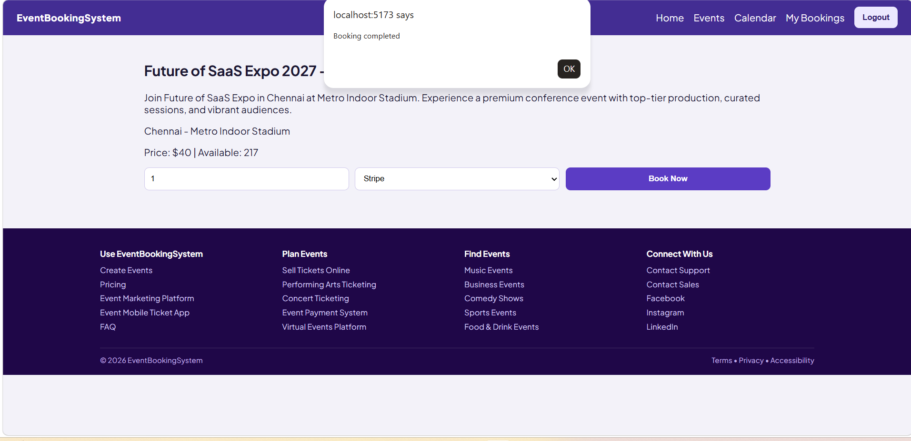

### My Bookings & Notifications
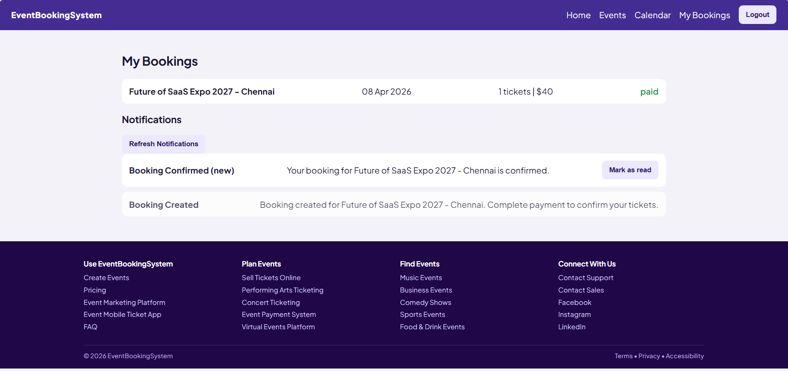

### Calendar Page
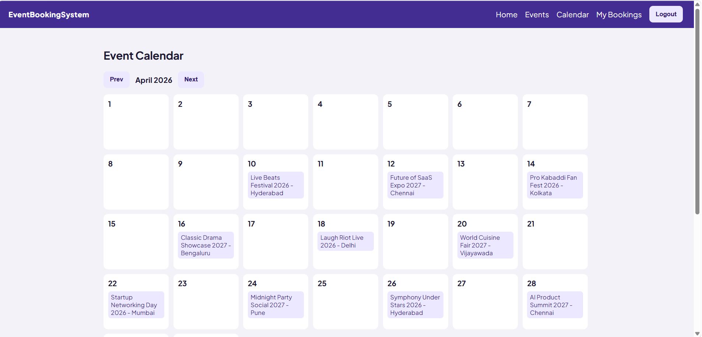

### Discover by Category
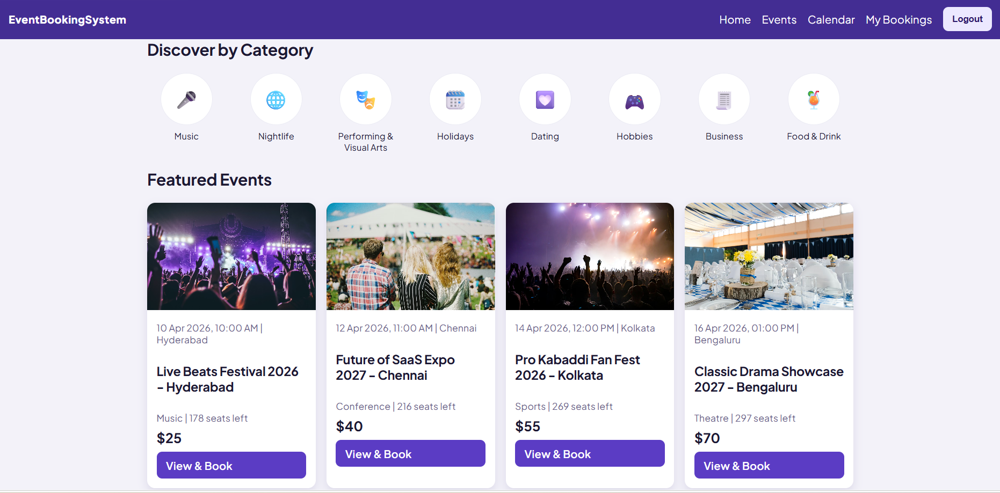

### Admin Page
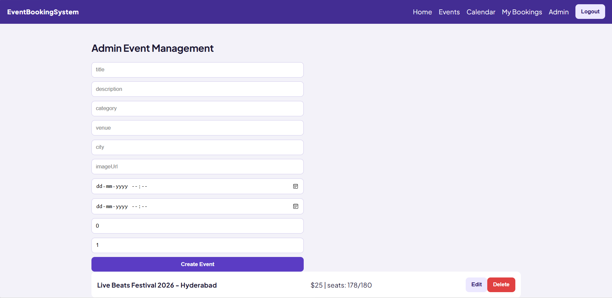

### Admin Adding Event
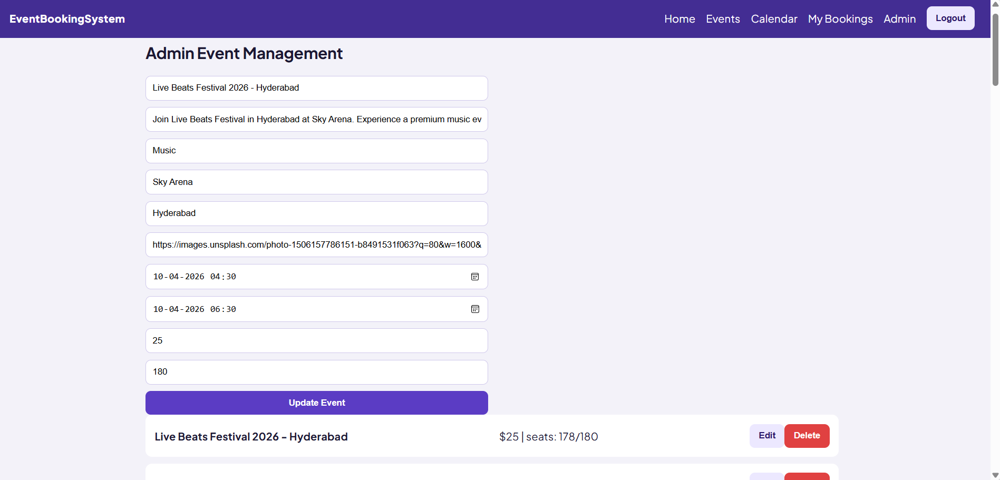

### Admin Adding Event (Step 2)
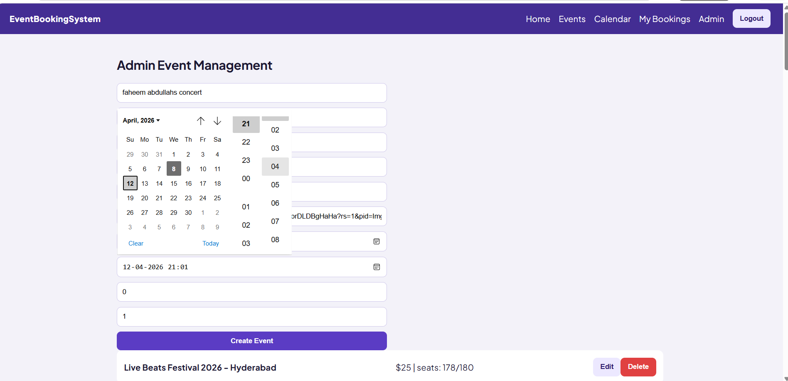

### Admin Adding Event Success
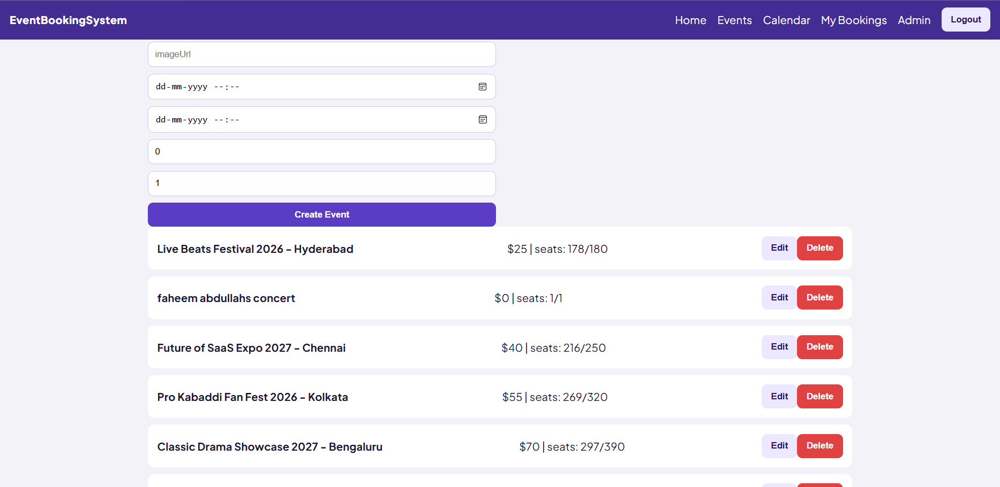

### Added Event Reflection
